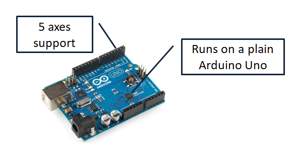
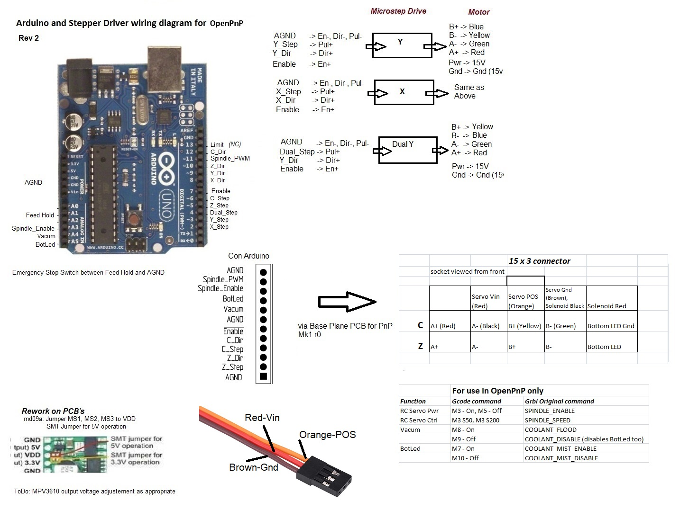

## Grbl Firmware for OpenPnP

### Features
 - Dual Y axis
 - PWM output to control an Remote Control (RC) Servo for Drag Feeder
 - Two switches for Vacum and LED
 - Support for M114 and M115
 - Limit switch free design with Soft Limits on 3 axes after visual homing (optional)

### A Machine in Action
https://user-images.githubusercontent.com/26599790/117642339-12d76100-b17f-11eb-941d-1dac84b9935f.mp4

### Wiring Diagram

### Repurposed GCodes
Function | Command
----|-----
RC Servo Power  | M3 - On, M5 - Off
RC Servo Positon | S30 - raise, S90 - lower
Vacum  | M8 - On, M9 - Off
LED | M7 - On, M10 - Off

### GCode Driver Commands

Setting | GCode
----|-----
CONNECT_COMMAND | G21 ; Set millimeters mode   G90 ; Set absolute positioning mode  M114 ; to sync grbl and openPnP
HOME_COMMAND | $H;  G92 X0 Y0 Z0
MOVE_TO_COMMAND | G0 {X:X%.4f} {Y:Y%.4f} {Z:Z%.4f} {Rotation:C%.4f} F{FeedRate:%.0f}
MOVE_TO_COMPLETE_COMMAND |G4 P0; Wait for moves to complete before returning
COMMAND_CONFIRM_REGEX | ^ok.*
POSITION_REPORT_REGEX | <WPos:(?<x>-?\d+\.\d+),(?<y>-?\d+\.\d+),(?<z>-?\d+\.\d+),(?<rotation>-?\d+\.\d+)>
COMMAND_ERROR_REGEX  | ^Crash.*